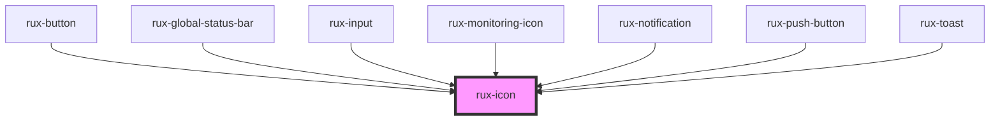

# rux-icon# Icons

Display icons used in the Astro Design System

<!-- Auto Generated Below -->

## Properties

| Property            | Attribute | Description                                                                                                                    | Type     | Default     |
| ------------------- | --------- | ------------------------------------------------------------------------------------------------------------------------------ | -------- | ----------- |
| `icon` _(required)_ | `icon`    | The icon name                                                                                                                  | `string` | `undefined` |
| `size`              | `size`    | The size of the icon. Can be 'extra-small', 'small', 'normal', 'large', 'auto' or any custom value ('30px', '1rem', '3.321em') | `string` | `'normal'`  |

## Shadow Parts

| Part     | Description          |
| -------- | -------------------- |
| `"icon"` | the icon in rux-icon |

## Dependencies

### Used by

 - [rux-button](../rux-button)
 - [rux-global-status-bar](../rux-global-status-bar)
 - [rux-input](../rux-input)
 - [rux-monitoring-icon](../rux-monitoring-icon)
 - [rux-notification](../rux-notification)
 - [rux-push-button](../rux-push-button)
 - [rux-toast](../rux-toast)

### Graph

----------------------------------------------

*Built with [StencilJS](https://stenciljs.com/)*
